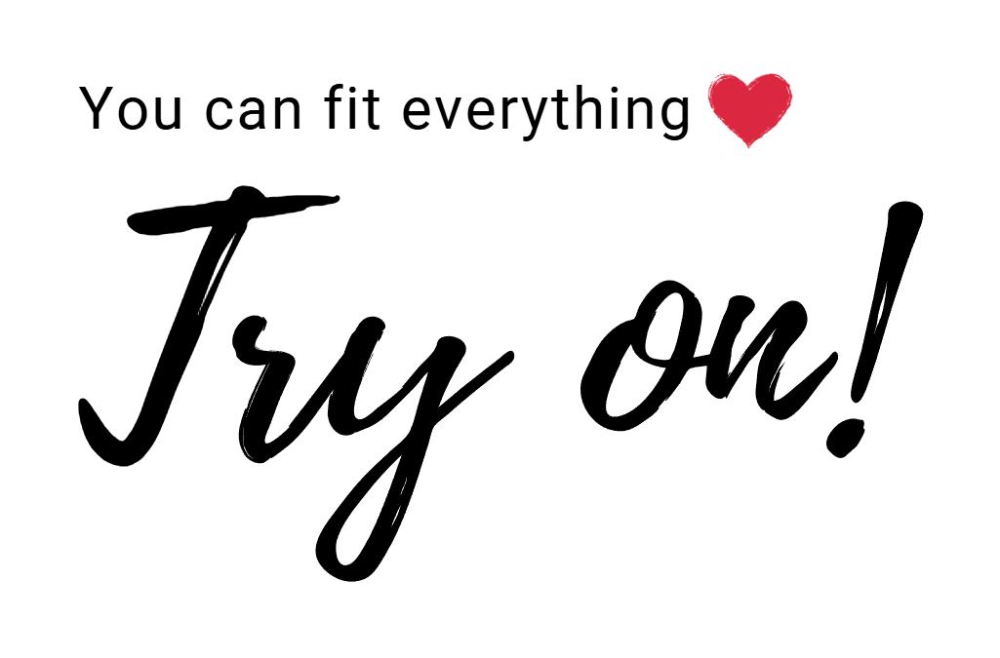

<!-- Improved compatibility of back to top link: See: https://github.com/othneildrew/Best-README-Template/pull/73 -->
<a id="readme-top"></a>
<!--
*** Thanks for checking out the Best-README-Template. If you have a suggestion
*** that would make this better, please fork the repo and create a pull request
*** or simply open an issue with the tag "enhancement".
*** Don't forget to give the project a star!
*** Thanks again! Now go create something AMAZING! :D
-->


<!-- PROJECT SHIELDS -->
<!--
*** I'm using markdown "reference style" links for readability.
*** Reference links are enclosed in brackets [ ] instead of parentheses ( ).
*** See the bottom of this document for the declaration of the reference variables
*** for contributors-url, forks-url, etc. This is an optional, concise syntax you may use.
*** https://www.markdownguide.org/basic-syntax/#reference-style-links
-->
[![Contributors][contributors-shield]][contributors-url]
[![Forks][forks-shield]][forks-url]
[![Stargazers][stars-shield]][stars-url]
[![Issues][issues-shield]][issues-url]


<!-- PROJECT LOGO -->
<br />
<div align="center">
  <a href="https://github.com/Page0526/virtual-try-on">
    
  </a>

  <h3 align="center">EasyFit</h3>

  <p align="center">
    An awesome virtual try-on app built with Flutter!
    <br />
    <br />
    <a href="https://github.com/Page0526/virtual-try-on">View Demo</a>
    &middot;
    <a href="https://github.com/Page0526/virtual-try-on/issues/new?labels=bug&template=bug-report---.md">Report Bug</a>
    &middot;
    <a href="https://github.com/Page0526/virtual-try-on/issues/new?labels=enhancement&template=feature-request---.md">Request Feature</a>
  </p>
</div>


<!-- TABLE OF CONTENTS -->
<details>
  <summary>Table of Contents</summary>
  <ol>
    <li>
      <a href="#about-the-project">About The Project</a>
      <ul>
        <li><a href="#built-with">Built With</a></li>
      </ul>
    </li>
    <li>
      <a href="#getting-started">Getting Started</a>
      <ul>
        <li><a href="#prerequisites">Prerequisites</a></li>
        <li><a href="#installation">Installation</a></li>
      </ul>
    </li>
    <li><a href="#usage">Usage</a></li>
    <li><a href="#roadmap">Roadmap</a></li>
    <li><a href="#contributing">Contributing</a></li>
    <li><a href="#license">License</a></li>
    <li><a href="#contact">Contact</a></li>
    <li><a href="#acknowledgments">Acknowledgments</a></li>
  </ol>
</details>


<!-- ABOUT THE PROJECT -->
## About The Project
<div align='center'>
  
</div>

Người tiêu dùng gặp khó khăn trong việc hình dung sản phẩm thực tế khi mua sắm thời trang online. Việc lựa chọn trang phục phù hợp không chỉ dựa vào sở thích mà còn phải xét đến các yếu tố như vóc dáng, phong cách cá nhân và khả năng kết hợp với các món đồ khác. Một lựa chọn phù hợp không chỉ giúp giảm tỷ lệ đổi trả mà còn góp phần tăng doanh số bán hàng. EasyFit ra đời nhằm cung cấp một giải pháp toàn diện giúp nâng cao trải nghiệm mua sắm trực tuyến thông qua các tính năng: 
- Phòng thử đồ ảo, cho phép người dùng thử trang phục trên ảnh cá nhân nhờ công nghệ AI mô phỏng chân thực
- Gợi ý trang phục phù hợp, đưa ra đề xuất sản phẩm dựa trên phong cách thời trang, màu sắc và trang phục hiện có
- Tích hợp mua sắm, giúp người dùng dễ dàng đặt hàng qua các sàn thương mại điện tử sau khi thử đồ
- StyleMate, trợ lý ảo AI cung cấp thông tin về xu hướng thời trang, gợi ý cách phối đồ và tối ưu hóa trải nghiệm mua sắm.

Với những tính năng này, EasyFit không chỉ mang đến trải nghiệm trực quan hơn mà còn tối ưu hóa quy trình từ thử đồ đến mua hàng, giúp người dùng thuận tiện hơn và giảm rủi ro khi mua sắm trực tuyến. 🚀

<p align="right">(<a href="#readme-top">back to top</a>)</p>


### Built With

Flutter is built with

* [](#)
* [](#)
* [](#)
* [](#)

<p align="right">(<a href="#readme-top">back to top</a>)</p>


<!-- GETTING STARTED -->
## Getting Started

### Prerequisites

This is an example of how to list things you need to use the software and how to install them.
* npm
  ```sh
  npm install npm@latest -g
  ```

### Installation

Install necessary packages

1. Get a free API Key at [https://example.com](https://example.com)
2. Clone the repo
   ```sh
   git clone https://github.com/Page0526/virtual-try-on.git
   ```
3. Direct to client folder
4. ```sh
   cd client
   ```
3. Install flutter packages
   ```sh
   flutter pub get
   ```
4. Create .env file and enter your API in `.env`
   ```js
   GOOGLE_APIKEY = 'ENTER YOUR API';
   ```
5. Run server
   ```sh
   cd server/fashion_agent
   python main.py
   ```

<p align="right">(<a href="#readme-top">back to top</a>)</p>


<!-- USAGE EXAMPLES -->
## Usage

Get to the try-on screen and start try on whatever clothes you want!

<p align="right">(<a href="#readme-top">back to top</a>)</p>


<!-- ROADMAP -->
## Roadmap

See the [open issues](https://github.com/Page0526/virtual-try-on/issues) for a full list of proposed features (and known issues).

<p align="right">(<a href="#readme-top">back to top</a>)</p>


<!-- CONTRIBUTING -->
## Contributing

If you have a suggestion that would make this better, please fork the repo and create a pull request. You can also simply open an issue with the tag "enhancement".
Don't forget to give the project a star! Thanks again!

1. Fork the Project
2. Create your Feature Branch (`git checkout -b feature/AmazingFeature`)
3. Commit your Changes (`git commit -m 'Add some AmazingFeature'`)
4. Push to the Branch (`git push origin feature/AmazingFeature`)
5. Open a Pull Request

### Top contributors:

<a href="https://github.com/Page0526/virtual-try-on/graphs/contributors">
  
</a>

<p align="right">(<a href="#readme-top">back to top</a>)</p>


<!-- CONTACT -->
[contributors-shield]: https://img.shields.io/github/contributors/Page0526/virtual-try-on.svg?style=for-the-badge
[contributors-url]: https://github.com/Page0526/virtual-try-on/graphs/contributors
[forks-shield]: https://img.shields.io/github/forks/Page0526/virtual-try-on.svg?style=for-the-badge
[forks-url]: https://github.com/Page0526/virtual-try-on/network/members
[stars-shield]: https://img.shields.io/github/stars/Page0526/virtual-try-on.svg?style=for-the-badge
[stars-url]: https://github.com/Page0526/virtual-try-on/stargazers
[issues-shield]: https://img.shields.io/github/issues/Page0526/virtual-try-on.svg?style=for-the-badge
[issues-url]: https://github.com/Page0526/virtual-try-on/issues


<!-- MARKDOWN LINKS & IMAGES -->
<!-- https://www.markdownguide.org/basic-syntax/#reference-style-links -->
